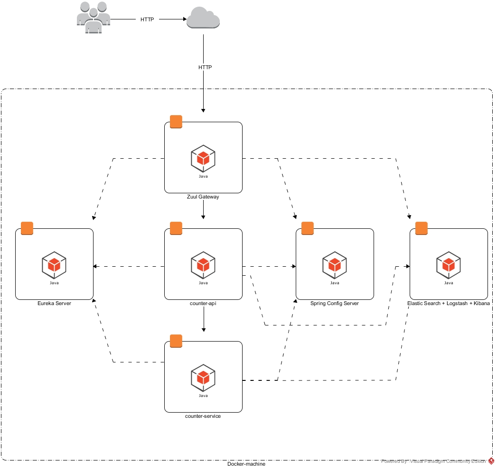

# Counter Cloud
### Pre-requirements
* Windows 7 or later
* JDK 8
* MAVEN 3.2
* Oracle Virtual Box
* more then 8 GB RAM
* more than 3 Cores CPU

### Architecture

### Run application:
1. configure environment variables in [start.bat] file
2. run start.bat
	2.1. mount application directory as [app] in Oracle Virtual Box (counter-hub->Settings->Shared Folders->Add new shared folder)
3. enjoy

### In case errors:
1. connect to machine using command: docker-machine ssh counter-hub
2. restart container in following order:
	2.1. registry
	2.2. configuration
	2.3. counter-service
	2.4. counter-api
	2.5. gateway 
